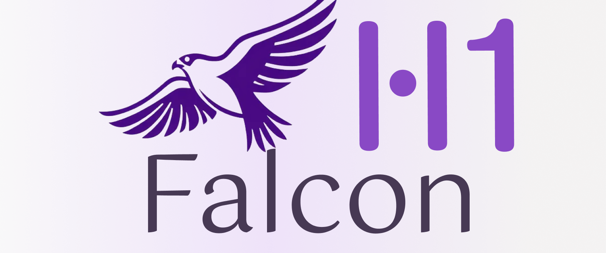

<p align="center">
  <a href="https://chat.falconllm.tii.ae/">🦅 <strong>Falcon-H Chat</strong></a> |
  <a href="https://huggingface.co/collections/tiiuae/falcon-h1-6819f2795bc406da60fab8df">🤗 <strong>Hugging Face</strong></a> |
  <a href="https://arxiv.org/abs/2507.22448">📄 <strong>Paper </strong></a> |
  <a href="https://falcon-lm.github.io/blog/falcon-h1/">📰 <strong>Blog</strong></a> |
  <a href="https://tiiuae.github.io/Falcon-H1/">📄 <strong>Documentation</strong></a> |
  <a href="https://huggingface.co/spaces/tiiuae/Falcon-H1-playground">🖥️ <strong>Hugging Face Demo</strong></a> |
  <a href="https://discord.gg/trwMYP9PYm">💬 <strong>Discord</strong></a>
</p>

## News

- 07/31/2025 The [Technical Report](https://arxiv.org/abs/2507.22448) for Falcon-H1 series is now relreased! 
- 07/09/2025 [Falcon-H1 series](https://huggingface.co/collections/tiiuae/falcon-h1-6819f2795bc406da60fab8df) is now [integrated into llama.cpp](https://github.com/ggml-org/llama.cpp)!
- 06/30/2025 [Falcon-H1 series](https://huggingface.co/collections/tiiuae/falcon-h1-6819f2795bc406da60fab8df) is now [integrated into several fine-tuning frameworks (axolotl, llama-factory, unsloth)](https://tiiuae.github.io/Falcon-H1/finetuning/)! 
- 05/21/2025 [Falcon-H1 series](https://huggingface.co/collections/tiiuae/falcon-h1-6819f2795bc406da60fab8df) is finally out!
---

## 🚀 Introduction

We are excited to introduce **Falcon-H1**, the latest evolution in the Falcon family of large language models. Built upon an advanced **hybrid architecture**—where each block integrates both **State Space Models (SSMs)** and **Attention Mechanisms**, these models span a wide range of scales, from **500 million to 34 billion parameters**, making them suitable for both lightweight inference on edge devices and large-scale deployments in data centers.

**Falcon-H1** was initially trained with support for **18 core languages**, with scalability to **100+ languages**, achieving state-of-the-art multilingual and reasoning performances in **instruction following**, **maths**, **coding**, and **multilingual tasks**.

---

## ✨ Key Highlights

Built by the **Technology Innovation Institute (TII)** in Abu Dhabi, **Falcon-H1** is the latest step in pushing the frontier of hybrid transformer design:

### 🧩 Hybrid Architecture 
Each transformer block processes all channels through both **SSM** and **Attention** in parallel, then **sums the outputs**. This allows the model to benefit from both **long-range memory** (via SSMs) and **local/global attention** simultaneously.

### 📏 Scalable Sizes 
Models available at multiple scales or variants: **500M**, **1.5B**, **1.5B-Deep**, **3B**, **7B**, and **34B** parameters.

### 🧠 Efficient Reasoning 
The hybrid structure enhances **reasoning** and **task generalization**.
  
### 🌐 Multilingual by Design 
Native training in **18 languages**, with scalability to 100+ languages thanks to our **multilingual tokenizer** trained on diverse language datasets, with strong **zero-shot translation** and **instruction-following** abilities.

### 🤖 Instruction-Following and Agent Capabilities 
Tuned for **instruction following**, **multi-turn conversations**, and already **integrated with major inference engines** such as **vLLM**, **Hugging Face Transformers**, and **llama.cpp** — with more coming soon.


---

## 🧭 Where to Start?

We provide the following documentation and resources to begin working with Falcon-H1:

- 💬 **Quick Deploy**: Try Falcon-H1 instantly using our hosted [Chat Interface](https://chat.falconllm.tii.ae/auth) or the [Live Demo from Hugging Face](https://huggingface.co/spaces/tiiuae/Falcon-H1-playground)
- 🛠️ **Inference Toolkits**: Compatible out-of-the-box with **vLLM**, **Transformers**, and **llama.cpp**. 👉 [Deployment Instructions](https://github.com/tiiuae/Falcon-H1/blob/main/docs/deployment.md). Other runtimes are in progress.
- ⚙️ **Fine-tuning**: Compatible with most frameworks based on Hugging Face Transformers library, out-of-the-box with **OUMI**, **Llama-Factory**, etc. 👉 [Fine-Tuning Guidelines](https://github.com/tiiuae/Falcon-H1/blob/main/docs/finetuning.md). More framework support coming soon!
- 💻 **Local Setup**: Full **GGUF** and **HF** formats available. Run it efficiently on both GPU and CPU.
- 🔬 **Research**: Learn more about our novel hybrid design in the [Falcon-H1 technical report]() (Coming soon).

---

## ⚡ Inference

Make sure to install the latest version of `transformers` or `vllm`, eventually install these packages from source:

```bash
pip install git+https://github.com/huggingface/transformers.git
```

Refer to [the official vLLM documentation for more details on building vLLM from source](https://docs.vllm.ai/en/latest/getting_started/installation/gpu.html#build-wheel-from-source).

### 🤗 Transformers
[Transformers](https://github.com/huggingface/transformers) is a library of pretrained natural language processing for inference and training.
Refer to the snippet below to run H1 models using 🤗 transformers:

```python
import torch
from transformers import AutoModelForCausalLM, AutoTokenizer

# Load the model
model_id = "tiiuae/Falcon-H1-1B-Base"
model = AutoModelForCausalLM.from_pretrained(
    model_id,
    torch_dtype=torch.bfloat16,
    device_map="auto"
)

# Load the tokenizer
tokenizer = AutoTokenizer.from_pretrained(model_id)

# Perform text generation below
```

### 🚄 vLLM

[vLLM](https://github.com/vllm-project/vllm) is a high-throughput and memory-efficient inference and serving engine for LLMs.
To run Falcon-H1 models, you can refer to the following command:

```bash
# pip install vllm
vllm serve tiiuae/Falcon-H1-1B-Instruct --tensor-parallel-size 2 --data-parallel-size 1
```

### 🔧 llama.cpp

Falcon-H1 is now natively supported into `llama.cpp` !

All official GGUF files can be found on [our official Hugging Face collection](https://huggingface.co/collections/tiiuae/falcon-h1-6819f2795bc406da60fab8df).

---

#### 1. Prerequisites

* **CMake** ≥ 3.16
* A **C++17**-compatible compiler (e.g., `gcc`, `clang`)
* **make** or **ninja** build tool
* (Optional) **Docker**, for OpenWebUI integration

---

#### 2. Clone & Build

```bash
# Clone the Falcon-H1 llama.cpp fork
git clone https://github.com/ggml-org/llama.cpp
cd llama.cpp

# Create a build directory and compile
mkdir build && cd build
cmake ..         # Configure the project
make -j$(nproc)  # Build the binaries
```

> Tip: For GPU acceleration, refer to the llama.cpp [GPU guide](https://github.com/ggerganov/llama.cpp#gpu-support).

---

#### 3. Download a GGUF Model

Fetch the desired Falcon-H1 checkpoint from Hugging Face’s collection:

```bash
# Example: download the 1B Instruct model
wget https://huggingface.co/tiiuae/Falcon-H1-1.5B-Instruct-GGUF/resolve/main/Falcon-H1-1.5B-Instruct-Q5_K.gguf \
     -P models/
```

> All available GGUF files: [https://huggingface.co/collections/tiiuae/falcon-h1-6819f2795bc406da60fab8df](https://huggingface.co/collections/tiiuae/falcon-h1-6819f2795bc406da60fab8df)

---

#### 4. Run the llama-server

Start the HTTP server for inference:

```bash
./build/bin/llama-server \
  -m models/Falcon-H1-1B-Instruct-Q5_0.gguf \
  -c 4096 \
  -ngl 512 \
  --temp 0.1 \
  --host 0.0.0.0 \
  --port 11434
```

#### 5. Web UI via OpenWebUI
Use the popular OpenWebUI frontend to chat in your browser:

```bash
docker run -d \
  --name openwebui-test \
  -e OPENAI_API_BASE_URL="http://host.docker.internal:11434/v1" \
  -p 8888:8888 \
  ghcr.io/open-webui/open-webui:main
```

1. Open your browser at [http://localhost:8888](http://localhost:8888)
2. Select **Falcon-H1-1B-Instruct-Q5\_0** from the model list
3. Start chatting!

---

> For advanced tuning and custom flags, see the full llama.cpp documentation: [https://github.com/ggerganov/llama.cpp](https://github.com/ggerganov/llama.cpp)


Demo
Hardware: MacBook M4 Max Chip
Model:Falcon-H1-1B-Q6_K

https://github.com/user-attachments/assets/f4181da9-bebe-4ead-8970-4ff7bef3069d


---

## 📊 Performance and Throughput

A detailed dynamic evaluation report is provided in our [blogpost](https://falcon-lm.github.io/blog/falcon-h1/):

1. 🏆 We compare the performance of each **Falcon-H1** model against the strongest models not only with the same size but also twice their size.
2. 📈 We show that Falcon-H1 models achieve state-of-the-art performance in most benchmarks (reasoning, maths, coding, in-context learning, and more), outperforming some closed source models like gpt-4o-mini in coding, reasoning and instruction following related tasks.

The blog post also features a dedicated section comparing Falcon-H1's inference speed to leading attention-based models, across a wide range of sequence lengths, prefillinng and generation scenarios.

---

## 📦 Falcon-H1 Features at a Glance

- 🔄 **Parallel Hybrid Blocks**: Attention + SSM in every layer.
- 🌍 **100+ Languages Supported**: Multilingual instruction, chat, and translation.
- 📏 **Scalable Sizes**: From **0.5B** to **34B**.
- 🧩 **Full Ecosystem Integration**: Runs on widely used inference stacks and supports common file formats (**HF**, **GGUF**).
- 🔋 **Quantized + Fine-tune Friendly**: Models available in **8-bit**, **4-bit**, and standard **FP16**.

---

## 👥 Join the Community

Got feedback or want to build with Falcon-H1?  

Join the conversation on [Discord](https://discord.gg/trwMYP9PYm), follow us on [Hugging Face](https://huggingface.co/tiiuae), visit our [official website](https://falconllm.tii.ae/), or check out our roadmap and open issues on [GitHub](https://github.com/tiiuae/Falcon-H1/tree/main).

## Citation

Feel free to cite our work if you find it useful for your projects:

```bibtex
@misc{tiifalconh1,
    title = {Falcon-H1: A Family of Hybrid-Head Language Models Redefining Efficiency and Performance},
    url = {https://falcon-lm.github.io/blog/falcon-h1},
    author = {Falcon-LLM Team},
    month = {May},
    year = {2025}
}
```

---

<p align="center">
  
  
  
</p>
