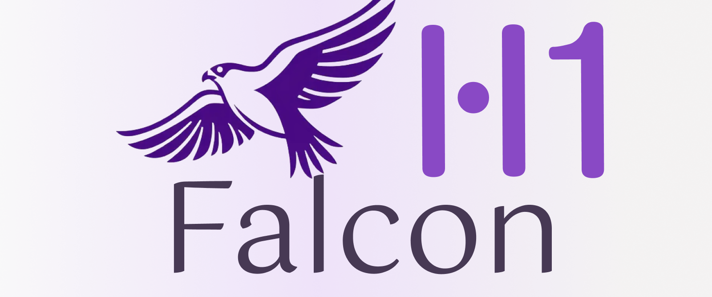

  <a href="https://chat.falconllm.tii.ae/">🦅 <strong>Falcon-H Chat</strong></a> |
  <a href="https://huggingface.co/collections/tiiuae/falcon-h1-6819f2795bc406da60fab8df">🤗 <strong>Hugging Face</strong></a> |
  <a href="#">📄 <strong>Paper (Coming soon)</strong></a> |
  <a href="https://falcon-lm.github.io/blog/falcon-h1/">📰 <strong>Blog</strong></a> |
  <a href="https://huggingface.co/spaces/tiiuae/Falcon-H1-playground">🖥️ <strong>Hugging Face Demo</strong></a> |
  <a href="https://discord.gg/trwMYP9PYm">💬 <strong>Discord</strong></a>

# Introduction

Welcome to the landing page of Falcon-H1 ! 

Below are the available pages

- [Evaluations](./evaluations.md): Detailed page about H1 series model evaluations
- [Deployment](./deployment.md): All you need to know about model deployment through available tools from the ecosystem.
- [Throughput and memory](./throughput.md): Detailed page about throughput and memory experiments

# Chat interface

Our chat interface is powered by [OpenInnovationAI](https://openinnovation.ai) and can be browsed [directly here](https://chat.falconllm.tii.ae/).

# Technical report

Our paper will be available soon, meanwhile, you can check [our technical blogpost](https://falcon-lm.github.io/blog/falcon-h1/)

# Community

Got feedback or want to build with Falcon-H1?

Join the conversation on [Discord](https://discord.gg/trwMYP9PYm), follow us on [Hugging Face](https://huggingface.co/tiiuae), visit our [official website](https://falconllm.tii.ae/), or check out our roadmap and open issues on [GitHub](https://github.com/tiiuae/Falcon-H1/tree/main).